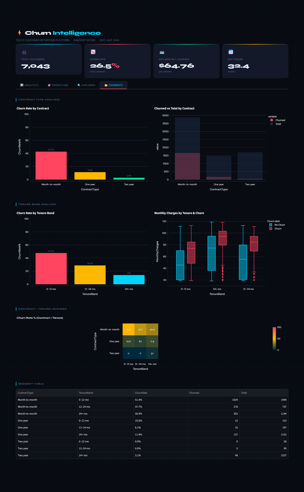

# ⚡ Churn Intelligence — Customer Churn Prediction System

> An end-to-end ML system that predicts telecom customer churn probability using a calibrated XGBoost model — served via a FastAPI backend with Redis caching, an interactive Streamlit dashboard with dark UI, deployed on Render with Docker.

[](https://customer-churn-prediction-python.onrender.com/)
[](https://fastapi.tiangolo.com/)
[](https://streamlit.io/)
[](https://xgboost.readthedocs.io/)
[](https://www.docker.com/)
[](https://mlflow.org/)
[](https://redis.io/)

---

## 📌 Problem Statement

Customer churn is one of the most critical challenges for subscription-based telecom businesses. Losing a customer is significantly more expensive than retaining one. This project builds a production-ready ML system that identifies at-risk customers **before they churn**, enabling proactive retention strategies.

**Dataset:** [IBM Telco Customer Churn](https://www.kaggle.com/datasets/blastchar/telco-customer-churn)

---

## ✨ Features

- 🎯 **Calibrated churn probability scoring** — isotonic regression calibration on XGBoost outputs
- 💰 **Cost-optimized threshold** — decision threshold derived from a false-negative / false-positive cost matrix
- 📊 **Dark Intelligence dashboard** — KPI cards, churn distribution, SHAP waterfall, segment heatmap
- 🔮 **Live prediction form** — input customer data, get instant probability + SHAP explanation
- 🔍 **Customer Explorer** — select any customer from the dataset for auto-filled prediction
- 🌊 **SHAP waterfall chart** — per-prediction feature contributions with base value and threshold line
- 📂 **Segment analysis tab** — churn rates by contract type × tenure band, including cross-segment heatmap
- ⚡ **Redis prediction cache** — deterministic inputs cached by feature hash, eliminates redundant inference
- 📦 **Batch prediction endpoint** — upload a CSV, get back `customer_id · churn_probability · risk_flag`
- 📡 **PSI drift monitoring** — `/v1/drift` detects feature distribution shift vs training baseline
- 🧪 **MLflow experiment tracking** — params, metrics, and artifacts logged per training run
- 🔁 **CI/CD pipeline** — GitHub Actions runs model tests on push, deploys to Render on pass
- 🐳 **Fully containerized** — Docker Compose orchestrates Redis → API (readiness-gated) → Frontend

---

## 🧰 Tech Stack

| Layer | Technology |
|---|---|
| ML Model | XGBoost (tuned) + IsotonicRegression calibration |
| Backend API | FastAPI + Pydantic v2 |
| Caching | Redis + fastapi-cache2 |
| Explainability | SHAP |
| Frontend | Streamlit |
| Experiment Tracking | MLflow |
| Containerization | Docker + Docker Compose |
| CI/CD | GitHub Actions |
| Deployment | Render |

---

## 🏗️ Architecture

```
┌─────────────────────────────────────────────────────────┐
│                      Render Cloud                       │
│                                                         │
│  ┌─────────────────────┐      ┌──────────────────────┐  │
│  │   Streamlit App     │      │     FastAPI App      │  │
│  │   (port 10000)      │─────▶│     (port 8000)      │  │
│  │                     │ HTTP │                      │  │
│  │  • Analytics tab    │      │  /ready  /health     │  │
│  │  • Prediction tab   │      │  /v1/predict         │  │
│  │  • Explorer tab     │      │  /v1/predict/batch   │  │
│  │  • Segments tab     │      │  /v1/explain         │  │
│  │                     │      │  /v1/drift           │  │
│  │  Dark Intelligence  │      │  /v1/model-info      │  │
│  │  theme + animations │      │                      │  │
│  └─────────────────────┘      └──────────┬───────────┘  │
│                                          │               │
│              ┌───────────────────────────┤               │
│              │                           │               │
│  ┌───────────▼──────┐      ┌────────────▼────────────┐  │
│  │   Redis Cache    │      │     Model Artifacts     │  │
│  │                  │      │                         │  │
│  │  Prediction KV   │      │  xgb_tuned_model.pkl    │  │
│  │  (feature hash)  │      │  isotonic_calibrator    │  │
│  └──────────────────┘      │  scaler.pkl             │  │
│                             │  psi_baseline.json      │  │
│                             └─────────────────────────┘  │
└─────────────────────────────────────────────────────────┘

Training (local, outside Docker):
  train.py ──▶ RandomizedSearchCV ──▶ IsotonicRegression ──▶ MLflow run
```

- Streamlit communicates with FastAPI via HTTP with **exponential backoff (max 3 retries)**
- All `/v1/*` endpoints return **503** until model artifacts are fully loaded (`_ready` flag)
- Docker `depends_on: service_healthy` ensures Streamlit never starts before API is ready
- `X-Model-Version` header injected on every API response via middleware

---

## 🔌 API Endpoints

Base URL: `https://customer-churn-prediction-python.onrender.com`

| Method | Endpoint | Description |
|---|---|---|
| `GET` | `/` | Root — confirms API running |
| `GET` | `/health` | Liveness probe — always 200 if process alive |
| `GET` | `/ready` | Readiness probe — 200 only when all artifacts loaded |
| `GET` | `/v1/model-info` | Model metadata, version, threshold, feature count |
| `POST` | `/v1/predict` | Single prediction — probability + risk flag |
| `POST` | `/v1/predict/batch` | CSV upload — per-row scores (async if >1000 rows) |
| `POST` | `/v1/explain` | SHAP — base value + feature contributions |
| `GET` | `/v1/drift` | Drift endpoint info |
| `POST` | `/v1/drift` | PSI drift check for numeric features |

### `/v1/predict` — Request Body

```json
{
  "gender": 1,
  "SeniorCitizen": 0,
  "Partner": 1,
  "Dependents": 0,
  "tenure": 12,
  "PhoneService": 1,
  "PaperlessBilling": 1,
  "MonthlyCharges": 70.35,
  "TotalCharges": 844.20,
  "MultipleLines_No_phone_service": 0,
  "MultipleLines_Yes": 1,
  "InternetService_Fiber_optic": 1,
  "InternetService_No": 0,
  "OnlineSecurity_Yes": 0,
  "OnlineBackup_Yes": 0,
  "DeviceProtection_Yes": 0,
  "TechSupport_Yes": 0,
  "StreamingTV_Yes": 0,
  "StreamingMovies_Yes": 0,
  "Contract_One_year": 0,
  "Contract_Two_year": 0,
  "PaymentMethod_Credit_card_automatic": 0,
  "PaymentMethod_Electronic_check": 1,
  "PaymentMethod_Mailed_check": 0
}
```

### `/v1/predict` — Response

```json
{
  "churn_probability": 0.7312,
  "churn_risk": "High",
  "x_cache": "MISS"
}
```

### `/v1/predict/batch` — Usage

```bash
curl -X POST "http://localhost:8000/v1/predict/batch" \
  -F "file=@customers.csv"
```

Response (≤1000 rows, inline):
```json
{
  "status": "ok",
  "n": 250,
  "results": [
    { "customer_id": "C001", "churn_probability": 0.7312, "risk_flag": "High" },
    { "customer_id": "C002", "churn_probability": 0.1841, "risk_flag": "Low" }
  ]
}
```

Response (>1000 rows, queued):
```json
{
  "status": "queued",
  "job_id": "a3f9b2c14d88",
  "message": "1543 rows queued for background processing."
}
```

### `/v1/drift` — Usage

```bash
curl -X POST "http://localhost:8000/v1/drift" \
  -H "Content-Type: application/json" \
  -d '[{"tenure": 8, "MonthlyCharges": 65.0, "TotalCharges": 520.0}]'
```

Response:
```json
{
  "drift_alert": false,
  "retraining_recommended": false,
  "features": {
    "tenure":         { "psi": 0.03, "status": "stable",   "n_records": 500 },
    "MonthlyCharges": { "psi": 0.11, "status": "moderate",  "n_records": 500 },
    "TotalCharges":   { "psi": 0.07, "status": "stable",   "n_records": 500 }
  }
}
```

PSI thresholds: `stable < 0.10 · moderate 0.10–0.20 · significant > 0.20`

---

## 🧠 Model Details

| Property | Value |
|---|---|
| Algorithm | XGBoost (tuned via RandomizedSearchCV, 25 iter, 5-fold CV) |
| Calibration | IsotonicRegression on train raw probabilities |
| Output | Calibrated churn probability (0.0 – 1.0) |
| Decision threshold | **0.22** (cost-optimized: FN = 10×, FP = 1×) |
| ROC-AUC | ~0.84 |
| Recall (at threshold) | ~0.84 |
| Artifacts | `xgb_tuned_model.pkl` · `isotonic_calibrator.pkl` · `scaler.pkl` · `psi_baseline.json` |

**Preprocessing:**
- Feature order enforced via `FEATURE_COLUMNS`
- `StandardScaler` applied only to `tenure`, `MonthlyCharges`, `TotalCharges`
- All categorical features one-hot encoded prior to training

**Threshold rationale:** 0.22 is derived from a cost matrix where a missed churner (false negative) costs ~10× more than a wrongly-flagged non-churner (false positive). Maximises `−(10·FN + 1·FP)` across a threshold sweep from 0.20 to 0.60.

---

## 🖥️ Frontend Dashboard

Built with Streamlit. **Dark Intelligence** theme — `#080B12` background, `#131929` cards, Syne + DM Sans fonts, fade-slide-up card animations, custom CSS injected via `st.markdown`.

### 📊 Tab 1 — Analytics
- KPI cards: total customers, churn rate, avg monthly charges, avg tenure
- Donut chart — churn split with centre annotation
- Box plots — tenure and charges by churn status
- Histogram — churn by contract type

### 🎯 Tab 2 — Prediction
- Customer input form (tenure, charges, senior/partner/dependents)
- Animated gauge — churn probability with amber threshold line at 22%
- Risk badge — pulsing red for High, solid green for Low
- SHAP waterfall — top 10 feature contributions (red = toward churn, blue = away, amber = final score)

### 🔍 Tab 3 — Explorer
- Dropdown to select any customer from the processed dataset
- Displays full feature record as a table

### 📂 Tab 4 — Segments
- Churn rate bars by contract type and tenure band
- Monthly charges box plot by tenure band and churn status
- Contract × Tenure cross-heatmap (red = high churn, green = low)
- Full segment summary table

---

## 📸 Screenshots

### 📊 Analytics Tab


### 🎯 Prediction — High Risk


### ✅ Prediction — Low Risk


### 🔍 Customer Explorer


### 🔍 Segments Tab


---

## 🧪 MLflow Experiment Tracking

MLflow runs **outside Docker**, during training only.

```bash
python train.py          # train + log run
mlflow ui --port 5000    # view at http://localhost:5000
```

Each run logs params (`n_estimators`, `max_depth`, `learning_rate`, `subsample`, `colsample_bytree`, `min_child_weight`, `decision_threshold`, `calibration_method`), metrics (`test_roc_auc`, `test_recall`, `test_precision`, `test_f1`, confusion matrix counts), and all model artifacts.

MLflow does **not** need to be running for the app to work.

---

## 🔁 CI/CD — GitHub Actions

**On every push** — runs `pytest tests/test_model.py`. Asserts: artifacts load, AUC > 0.80, output shape correct, probabilities in [0,1], risk labels valid, all feature columns present.

**On push to `main`** (tests must pass) — triggers Render deploy hooks for API and frontend services.

Required GitHub secrets: `RENDER_DEPLOY_HOOK_API` · `RENDER_DEPLOY_HOOK_FRONTEND`

---

## 🐳 Run Locally with Docker

```bash
# Clone
git clone https://github.com/khareparth12-sketch/customer-churn-prediction-python-scikitlearn.git
cd customer-churn-prediction-python-scikitlearn

# Build and start (Redis → API → Frontend)
docker-compose up --build

# Streamlit dashboard → http://localhost:10000
# FastAPI docs        → http://localhost:8000/docs
# API readiness       → http://localhost:8000/ready

# Stop
docker-compose down
```

> ⚠️ First startup takes ~30s — API waits for Redis health, Frontend waits for API `/ready`.

---

## 🔬 Retrain the Model

```bash
# In venv, outside Docker
python train.py

# View run in MLflow
mlflow ui --port 5000

# Restart Docker to pick up new artifacts
docker-compose down && docker-compose up --build
```

---

## 📁 Project Structure

```
churn-analysis/
├── api/
│   ├── app.py               # FastAPI — routes, readiness probe, _ready flag
│   ├── schema.py            # Pydantic v2 input validation
│   ├── utils.py             # FEATURE_COLUMNS, NUMERIC_COLUMNS
│   ├── cache.py             # Redis cache helpers
│   └── logger.py            # Structured JSON logger
├── dashboard/
│   └── app.py               # Streamlit Dark Intelligence dashboard (4 tabs)
├── models/
│   ├── xgb_tuned_model.pkl
│   ├── isotonic_calibrator.pkl
│   ├── scaler.pkl
│   └── psi_baseline.json
├── data/
│   ├── raw/telco_churn.csv
│   └── processed/
│       ├── churn_cleaned.csv
│       └── telco_final_processed.csv
├── notebooks/
│   ├── 01_data_overview.ipynb
│   ├── 02_data_cleaning.ipynb
│   ├── 03_eda_churn.ipynb
│   ├── 04_preprocessing.ipynb
│   ├── 05_modeling_and_tuning.ipynb
│   └── 06_model_interpretation.ipynb
├── tests/
│   └── test_model.py        # pytest — AUC gate, shape, bounds, labels
├── reports/
│   ├── churn_analysis_report.md
│   └── model_report.md
├── screenshots/
│   ├── analytics.png
│   ├── churn_predict.png
│   ├── noChurn_predict.png
│   └── explore.png
├── train.py                 # Training script with MLflow tracking
├── docker-compose.yaml
├── Dockerfile
├── requirements.txt
└── README.md
```

---

## 🚀 Live Demo

👉 **[https://customer-churn-prediction-python.onrender.com/](https://customer-churn-prediction-python.onrender.com/)**

> ⚠️ Hosted on Render's free tier — may take **30–60 seconds to cold start** if idle.

---

## 👤 Author

**Parth Khare**
- GitHub: [@khareparth12-sketch](https://github.com/khareparth12-sketch)

---

## 📄 License

This project is open source and available under the [MIT License](LICENSE).

---

<p align="center">Built with FastAPI · Streamlit · XGBoost · Redis · MLflow · Docker</p>