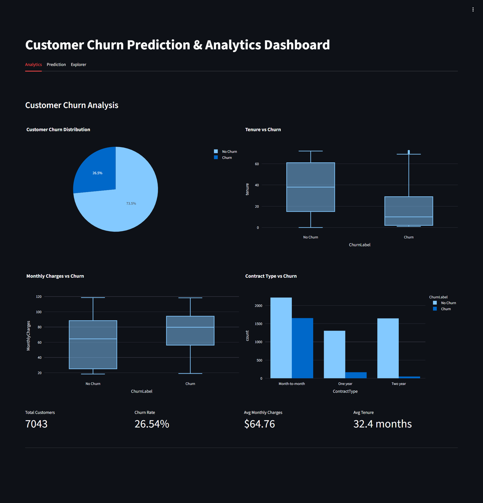
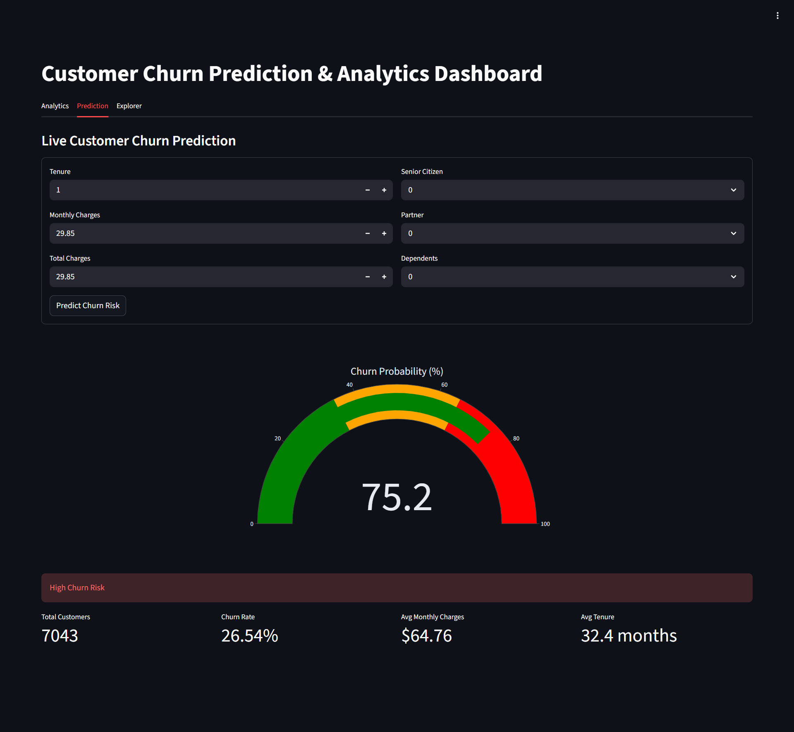
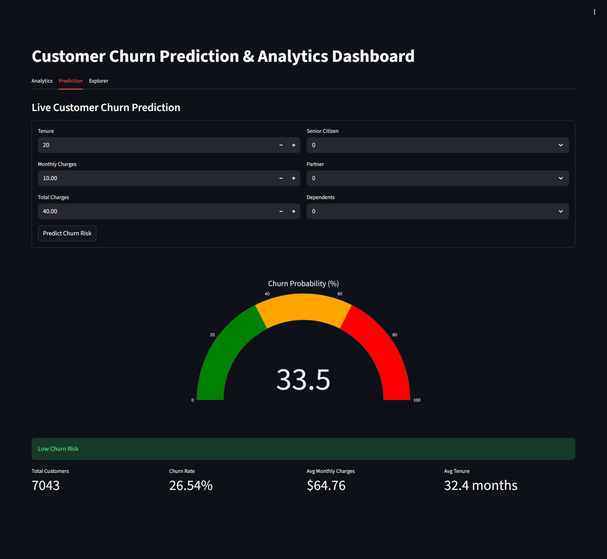
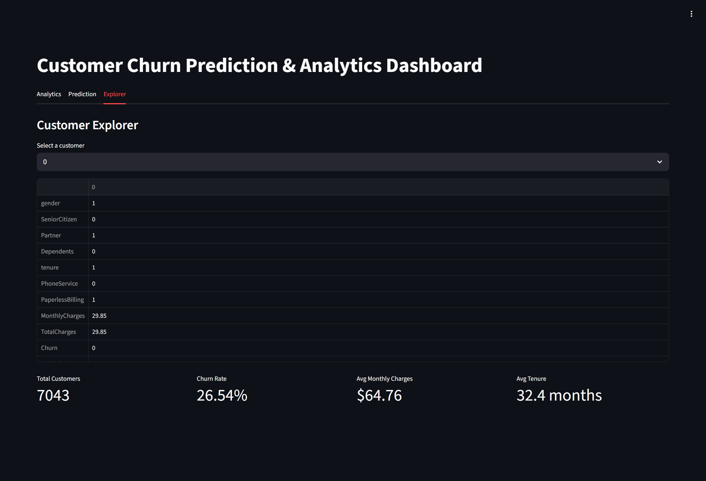

# 🔄 Customer Churn Prediction

> An end-to-end Machine Learning application that predicts customer churn probability using a tuned XGBoost model — served via a FastAPI backend and an interactive Streamlit dashboard, deployed on Render with Docker.

[](https://customer-churn-prediction-python.onrender.com/)
[](https://fastapi.tiangolo.com/)
[](https://streamlit.io/)
[](https://xgboost.readthedocs.io/)
[](https://www.docker.com/)

---

## 📌 Problem Statement

Customer churn is one of the most critical challenges for subscription-based telecom businesses. Losing a customer is significantly more expensive than retaining one. This project builds a production-ready ML system that identifies at-risk customers **before they churn**, enabling proactive retention strategies.

**Dataset:** [IBM Telco Customer Churn](https://www.kaggle.com/datasets/blastchar/telco-customer-churn)

---

## ✨ Features

- 🎯 **Churn probability scoring** with a business-tuned risk threshold (0.35)
- 📊 **Analytics dashboard** — KPIs, churn distribution charts, and key metrics
- 🔮 **Manual prediction form** — input customer data and get instant predictions
- 🔍 **Customer Explorer** — select any customer from the dataset for auto-filled predictions
- ⚡ **REST API** — clean FastAPI backend ready for integration
- 🐳 **Fully containerized** — Docker Compose multi-service setup
- ☁️ **Cloud deployed** — live on Render

---

## 🧰 Tech Stack

| Layer | Technology |
|---|---|
| ML Model | XGBoost (tuned) + Scikit-learn |
| Backend API | FastAPI |
| Frontend | Streamlit |
| Containerization | Docker + Docker Compose |
| Deployment | Render |

---

## 🏗️ Architecture

```
┌─────────────────────────────────────────────┐
│                  Render Cloud                │
│                                             │
│  ┌──────────────────┐  ┌─────────────────┐  │
│  │  Streamlit App   │  │   FastAPI App   │  │
│  │   (port 10000)   │──│   (port 8000)   │  │
│  │                  │  │                 │  │
│  │  • Analytics Tab │  │  /predict       │  │
│  │  • Predict Tab   │  │  /model-info    │  │
│  │  • Explorer Tab  │  │  /health        │  │
│  └──────────────────┘  └────────┬────────┘  │
│                                 │            │
│                        ┌────────▼────────┐   │
│                        │  xgb_tuned_     │   │
│                        │  model.pkl      │   │
│                        │  scaler.pkl     │   │
│                        └─────────────────┘   │
└─────────────────────────────────────────────┘
```

- Streamlit communicates with FastAPI over **localhost** with retry logic
- Both services are orchestrated via **Docker Compose**
- FastAPI loads the serialized model and scaler at startup

---

## 🔌 API Endpoints

Base URL: `https://customer-churn-prediction-python.onrender.com`

| Method | Endpoint | Description |
|---|---|---|
| `GET` | `/` | Root check — confirms API is running |
| `GET` | `/health` | Health status of the service |
| `GET` | `/model-info` | Model metadata and feature list |
| `POST` | `/predict` | Returns churn probability and risk flag |

### `/predict` — Request Body Example

```json
{
  "gender": "Male",
  "SeniorCitizen": 0,
  "Partner": "Yes",
  "Dependents": "No",
  "tenure": 12,
  "PhoneService": "Yes",
  "MultipleLines": "No",
  "InternetService": "Fiber optic",
  "OnlineSecurity": "No",
  "OnlineBackup": "No",
  "DeviceProtection": "No",
  "TechSupport": "No",
  "StreamingTV": "No",
  "StreamingMovies": "No",
  "Contract": "Month-to-month",
  "PaperlessBilling": "Yes",
  "PaymentMethod": "Electronic check",
  "MonthlyCharges": 70.35,
  "TotalCharges": 844.20
}
```

### `/predict` — Response Example

```json
{
  "churn_probability": 0.72,
  "risk_flag": "HIGH RISK",
  "threshold_used": 0.35
}
```

---

## 🧠 Model Details

| Property | Value |
|---|---|
| Algorithm | XGBoost (tuned via hyperparameter search) |
| Output | Churn probability (0.0 – 1.0) |
| Risk Threshold | **0.35** (business-oriented, favors recall) |
| Artifacts | `xgb_tuned_model.pkl`, `scaler.pkl` |

**Feature Engineering:**
- Strict feature ordering enforced via `FEATURE_COLUMNS`
- Scaling applied only to numeric features: `tenure`, `MonthlyCharges`, `TotalCharges`
- All categorical features passed as-is after encoding

> The threshold of **0.35** (rather than the default 0.5) is a deliberate business decision — it prioritizes catching more at-risk customers, accepting a slightly higher false positive rate.

---

## 🖥️ Frontend Dashboard

The Streamlit app has three tabs:

### 📊 Tab 1 — Analytics
- KPI metric cards (total customers, churn rate, etc.)
- Churn distribution visualizations

### 🔮 Tab 2 — Prediction
- Manual input form for all customer features
- Calls `/predict` and displays:
  - Churn probability score
  - Visual gauge chart
  - Risk level message (Low / High Risk)

### 🔍 Tab 3 — Customer Explorer
- Dropdown to select any customer from the dataset
- Auto-populates all input fields
- Run prediction instantly with one click

---

## 📸 Screenshots

### 📊 Analytics Tab


### 🔮 Prediction — Churn Detected


### ✅ Prediction — No Churn


### 🔍 Customer Explorer


---

## 🚀 Live Demo

👉 **[https://customer-churn-prediction-python.onrender.com/](https://customer-churn-prediction-python.onrender.com/)**

> ⚠️ Hosted on Render's free tier — the service may take **30–60 seconds to cold start** if it has been idle.

---

## 🐳 Run Locally with Docker

### Prerequisites
- [Docker](https://www.docker.com/) and [Docker Compose](https://docs.docker.com/compose/) installed

### Steps

```bash
# 1. Clone the repository
git clone https://github.com/khareparth12-sketch/customer-churn-prediction-python-scikitlearn.git
cd customer-churn-prediction-python-scikitlearn

# 2. Build and start both services
docker-compose up --build

# 3. Access the apps
# Streamlit → http://localhost:10000
# FastAPI    → http://localhost:8000/docs
```

To stop the services:

```bash
docker-compose down
```

---

## 📁 Project Structure

```
customer-churn-prediction-python-scikitlearn/
│
├── backend/
│   ├── main.py               # FastAPI app & endpoints
│   ├── xgb_tuned_model.pkl   # Trained XGBoost model
│   ├── scaler.pkl            # Feature scaler
│   ├── requirements.txt
│   └── Dockerfile
│
├── frontend/
│   ├── app.py                # Streamlit dashboard
│   ├── requirements.txt
│   └── Dockerfile
│
├── screenshots/
│   ├── analytics.png
│   ├── churn_predict.png
│   ├── noChurn_predict.png
│   └── explore.png
│
├── docker-compose.yml
└── README.md
```

---

## 🔭 Future Improvements

- [ ] Add SHAP explainability — show which features drove each prediction
- [ ] Batch prediction endpoint — upload a CSV and get bulk scores
- [ ] Model retraining pipeline with MLflow tracking
- [ ] Authentication layer for the API
- [ ] CI/CD pipeline with GitHub Actions
- [ ] A/B testing support for threshold experimentation

---

## 👤 Author

**Parth Khare**
- GitHub: [@khareparth12-sketch](https://github.com/khareparth12-sketch)

---

## 📄 License

This project is open source and available under the [MIT License](LICENSE).

---

<p align="center">
  Built with ❤️ using FastAPI, Streamlit, and XGBoost
</p>